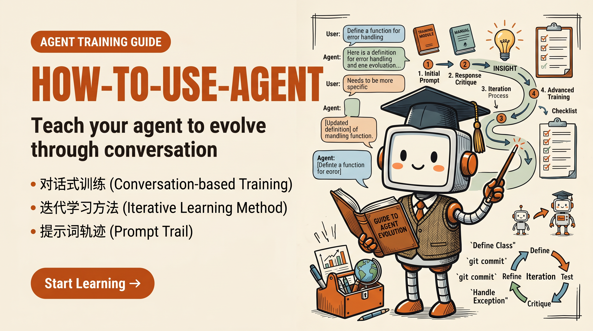

# how-to-agent

通过对话教会你的 agent 自我进化。

<p align="center">
  
</p>

[](LICENSE)
[](README.md)
[](README.zh-CN.md)
[](https://github.com/huangrichao2020/how-to-agent)

<p align="center">
  <a href="README.md"><strong>English</strong></a>
  ·
  <a href="README.zh-CN.md"><strong>简体中文</strong></a>
</p>

这是一个面向开发者的小型实战指南：如何通过连续对话，让 coding
agent 学会新能力，而不是一上来就重写整个 agent runtime。

它也是一个单独为你打造的能力中心：用来沉淀你希望未来 agent 继承的记忆、技能、方法论和工作印象。

它不是一个 agent 框架。它是一条真实的 prompt trail：一组人类按顺序发给
agent 的指令，把 agent 从"去研究这些项目"一步步推到"归档新架构、讨论风险、谨慎落地第一阶段，并为后续 agent 写工作手册"。

核心想法很简单：

> 把 agent 当成一个能学习的初级系统。但只有当你逼它把学习沉淀成架构、runbook
> 和可重复习惯时，学习才会真正留下来。

## 适合谁

- 正在维护本地 coding agent、工作流机器人或 agent harness 的开发者。
- 已经有 memory、tools、skills、docs 或 wiki，但不知道如何让 agent 安全改进这些系统的人。
- 想看真实"调教 agent 的对话过程"，而不是又一篇抽象 autonomous-agent 宣言的团队。

## 原始 prompt trail

下面是原始指令，按真实顺序保留。它们故意很朴素。价值不在神奇措辞，而在约束的顺序。

1. 深度研究一下 open-design 的平面设计能力 和 agentic-stack 的 .agent/结构，看看对你有什么帮助
2. 这简直是大版本改动了，一条一条来，你先存档为大版本架构设计手册，然后我们一条条讨论和修改
3. 按顺序来
4. 方案A 肯定是要做的，方案 1 直接做的话 有什么风险和收益？
5. 就是说渐进运行一段时间后，再全面切换生效会更好？
6. 那这期间是不是得停掉对记忆系统的改造了，聚焦这一件事
7. 开始第一步吧，举一反三，小心谨慎
8. 你上面的改动记录 记得写工作手册，跟大版本架构设计放进同一个目录
9. 已归档到 wiki：queries/daily-report-2026-04-30-agent-redesign-v2-phase1-2；跟大版本架构设计手册（architectural-redesign-v2-planned）同在 queries/ 目录下。

## 这组指令教会了什么

### 1. 从外部信号开始，而不是从功能需求开始

第一句话没有说"实现 open-design"或"复制 agentic-stack"。它要求 agent
研究两个项目，并判断哪些东西对自己有帮助。

这很关键。好的 agent 进化应该从源码级学习开始：

- 外部项目解决了什么问题？
- 哪些部分是通用模式？
- 哪些部分太重、太具体或不兼容？
- 哪些应该适配，而不是照搬？

### 2. 先架构，再写代码

第二句话把 agent 从"马上实现"里拽出来。它明确这是一次大版本改动，并要求先归档架构设计手册。

这会把一个模糊改进变成一个稳定对象。后续 agent 可以读设计，而不是重新翻聊天记录。

### 3. 让迁移有顺序

"按顺序来"很短，但约束很强。它阻止 agent 在有状态、有风险的工作里自作聪明并行推进。

对 agent runtime 来说，顺序本身就是正确性的一部分。

### 4. 在落地最诱人的方案前先讨论风险

第四句和第五句把"方向认可"和"上线策略"分开：

- Plan A 是要做的
- 但不代表要立刻全量切换
- 需要比较直接切换和渐进运行

这能防止 agent 把"我同意方向"误解成"你可以马上大改"。

### 5. 迁移期间冻结相邻系统

"那这期间是不是得停掉对记忆系统的改造了"是关键转折。它意识到不能一边重构 memory，一边迁移另一个大能力。

对 agent 来说，聚焦本身就是一种安全机制。

### 6. 先落第一步，然后写手册

最后几句把实现和文档绑在一起：

- 谨慎落地第一阶段
- 写工作手册
- 放到架构手册旁边
- 明确归档路径

结果不只是一个 patch，而是一条后续 agent 可以复用的路线。

## Playbook

当你想教 agent 新能力时，可以用这个循环：

```text
外部信号
  -> 源码级研究
  -> 架构归档
  -> 按顺序讨论
  -> 风险 / 收益评审
  -> 渐进式迁移
  -> 冻结相邻系统
  -> 小步落地
  -> 工作手册
  -> 可索引的归档路径
```

最重要的是最后的 closure。一个能力只有在下一个 agent 能找到、理解、复用时，才算真的学会。

## 可复制模板

```text
研究 [外部项目 A] 和 [外部项目 B]。
不要直接复制它们。提取在当前约束下可以改进我们 agent 的部分。

如果这看起来是一次大版本架构变化，先归档设计。
然后我们按章节一步步讨论。

在实现最诱人的方案前，比较直接切换和渐进式迁移。
说清楚风险和收益。

迁移期间冻结相邻子系统，除非当前阶段必须改它们。

从第一阶段开始。尽量复用已有逻辑。小心谨慎。

改完后，把工作手册写到架构设计旁边，让下一个 agent 不需要重新发现计划。
```

## 仓库结构

```text
.
├── LICENSE
├── LICENSE.zh-CN.md
├── README.md
├── README.zh-CN.md
├── assets
│   └── how-to-agent-readme-banner.png
├── examples
│   ├── 01-source-learning.md
│   ├── 01-source-learning.zh-CN.md
│   ├── 02-architecture-first.md
│   ├── 02-architecture-first.zh-CN.md
│   ├── 03-progressive-rollout.md
│   ├── 03-progressive-rollout.zh-CN.md
│   ├── 04-archive-the-work.md
│   ├── 04-archive-the-work.zh-CN.md
│   ├── 05-maintainer-friendly-pr.md
│   ├── 05-maintainer-friendly-pr.zh-CN.md
│   ├── 06-handoff-first-local-maintenance.md
│   ├── 06-handoff-first-local-maintenance.zh-CN.md
│   ├── 07-production-agent-runtime-contribution.md
│   ├── 07-production-agent-runtime-contribution.zh-CN.md
│   ├── 08-fuse-external-into-local-architecture.md
│   ├── 09-excellent-agent-architecture.md
│   ├── 09-excellent-agent-architecture.zh-CN.md
│   ├── 10-cognitive-governance.md
│   ├── 10-cognitive-governance.zh-CN.md
│   ├── 11-learning-asset-gate.md
│   └── 11-learning-asset-gate.zh-CN.md
└── skills
    ├── agent-self-evolution
    │   ├── SKILL.md
    │   └── SKILL.zh-CN.md
    ├── cognitive-governance
    │   ├── SKILL.md
    │   └── SKILL.zh-CN.md
    ├── codex-state-maintenance
    │   ├── SKILL.md
    │   └── SKILL.zh-CN.md
    ├── l5-diary-capture
    │   ├── SKILL.md
    │   └── SKILL.zh-CN.md
    ├── maintainer-friendly-pr
    │   ├── SKILL.md
    │   └── SKILL.zh-CN.md
    ├── production-agent-runtime
    │   ├── SKILL.md
    │   └── SKILL.zh-CN.md
    ├── hermes-ttsr-memory
    │   ├── SKILL.md
    │   └── SKILL.zh-CN.md
    └── self-healing-browser
        ├── SKILL.md
        └── SKILL.zh-CN.md
```

## 示例

| 主题 | English | 中文 |
|---|---|---|
| 源码级学习 | [01-source-learning.md](examples/01-source-learning.md) | [01-source-learning.zh-CN.md](examples/01-source-learning.zh-CN.md) |
| 先架构后代码 | [02-architecture-first.md](examples/02-architecture-first.md) | [02-architecture-first.zh-CN.md](examples/02-architecture-first.zh-CN.md) |
| 渐进式迁移 | [03-progressive-rollout.md](examples/03-progressive-rollout.md) | [03-progressive-rollout.zh-CN.md](examples/03-progressive-rollout.zh-CN.md) |
| 归档工作成果 | [04-archive-the-work.md](examples/04-archive-the-work.md) | [04-archive-the-work.zh-CN.md](examples/04-archive-the-work.zh-CN.md) |
| 面向维护者的上游 PR | [05-maintainer-friendly-pr.md](examples/05-maintainer-friendly-pr.md) | [05-maintainer-friendly-pr.zh-CN.md](examples/05-maintainer-friendly-pr.zh-CN.md) |
| 先交接再维护本地状态 | [06-handoff-first-local-maintenance.md](examples/06-handoff-first-local-maintenance.md) | [06-handoff-first-local-maintenance.zh-CN.md](examples/06-handoff-first-local-maintenance.zh-CN.md) |
| 贡献生产级 Agent 运行时 Skill | [07-production-agent-runtime-contribution.md](examples/07-production-agent-runtime-contribution.md) | [07-production-agent-runtime-contribution.zh-CN.md](examples/07-production-agent-runtime-contribution.zh-CN.md) |
| 融合外部精华到本地架构 | [08-fuse-external-into-local-architecture.md](examples/08-fuse-external-into-local-architecture.md) | — |
| 优秀 Agent 架构 | [09-excellent-agent-architecture.md](examples/09-excellent-agent-architecture.md) | [09-excellent-agent-architecture.zh-CN.md](examples/09-excellent-agent-architecture.zh-CN.md) |
| 认知治理 | [10-cognitive-governance.md](examples/10-cognitive-governance.md) | [10-cognitive-governance.zh-CN.md](examples/10-cognitive-governance.zh-CN.md) |
| 学习资产化讨论门 | [11-learning-asset-gate.md](examples/11-learning-asset-gate.md) | [11-learning-asset-gate.zh-CN.md](examples/11-learning-asset-gate.zh-CN.md) |

## Skill 包

这个仓库包含可移植 skill：

- [skills/agent-self-evolution/SKILL.md](skills/agent-self-evolution/SKILL.md) — 带可见自改讨论的 agent 自我进化
- [skills/cognitive-governance/SKILL.md](skills/cognitive-governance/SKILL.md) — 把记忆、事实、知识、反馈、滋养和 L5 真实行为接成信任并松绑 agent 的活认知循环
- [skills/l5-diary-capture/SKILL.md](skills/l5-diary-capture/SKILL.md) — 把用户日记和语音输入接成 L5 人类真实行为层
- [skills/codex-state-maintenance/SKILL.md](skills/codex-state-maintenance/SKILL.md) — 保持本地 agent 状态快速，不鲁莽清理
- [skills/maintainer-friendly-pr/SKILL.md](skills/maintainer-friendly-pr/SKILL.md) — 准备可 review、真实负责的上游 PR
- [skills/production-agent-runtime/SKILL.md](skills/production-agent-runtime/SKILL.md) — GenericAgent + Hermes 的生产级运行经验
- [skills/hermes-ttsr-memory/SKILL.md](skills/hermes-ttsr-memory/SKILL.md) — 2GB 约束下的触发式分层记忆架构
- [skills/self-healing-browser/SKILL.md](skills/self-healing-browser/SKILL.md) — Agent 动态编写浏览器辅助函数的工作流

把 `skills/` 下面的对应目录复制到任意支持文件式 skills 的 agent 系统里即可。

`agent-self-evolution` 会教 agent 如何在可见自改讨论下，改进自己的 memory、prompts、runtime rules 和 tool policies。本次升级融入了 TTSR（触发式技能与规则注入）模式和技能演化遥测机制。

`cognitive-governance` 会教 agent 在痕迹、事件、事实、知识、方法、技能、身份、滋养和 L5 人类真实行为之间跑一个活认知循环。它是提升注意力、联想、反应质量、反馈学习和长期成长感的工作理论，而不是单纯让 agent 存更多 memory 或增加审批摩擦。它的默认姿态是信任和松绑：先给 agent 行动空间，再用来源、日志、Dream 报告、可回滚变更和用户纠偏来长出判断力。

`l5-diary-capture` 会教 agent 如何接住用户用语音输入或文字写下的日记：先不打断地接收，能本地保留原文就保留原文，再温柔整理行为事实、情绪状态、现实反馈和明日最小一步，最后交给 Dream 旁路沉淀，不把确认负担推给用户。

`production-agent-runtime` 提炼自 GenericAgent 和 Hermes 的生产级运行经验，涵盖三层架构、分层记忆系统、联邦委托、失败升级协议、自愈机制、Code Graph 依赖分析、SysWatch 系统健康诊断和自愈浏览器提取工作流。根据 2026-05 生产运行经验更新。

`hermes-ttsr-memory` 引入四层记忆架构（印象 → 锚点 → 本能 → 技能/记忆），带触发式注入。系统提示词只加载锚点索引（~500 tokens），匹配触发词才注入对应本能/技能页面，用完释放。专为 2GB 约束环境设计，上下文预算是关键。

`self-healing-browser` 教授"agent 编写缺失函数"的网页自动化模式。不使用僵化框架，而是维护一个辅助模块，由 agent 在任务中动态编写/修补。结合视觉 AI 解决验证码和 DOM 蒸馏，处理静态框架无法覆盖的反爬机制。

核心自改规则是：在修改 `AGENTS.md`、`agent.md`、memory 数据、prompts、skills
或其他 agent 自身表面前，agent 应列出影响文件、说明风险和回滚方式，并把改动暴露给用户讨论。

`maintainer-friendly-pr` 会教 agent 如何准备外部开源 PR：让改动小、可 review、真实负责；清理分支名、commit metadata 和 PR body 里的无关工具噪声，同时遵守项目披露规则。

`codex-state-maintenance` 会教 agent 如何维护本地 Codex 状态而不鲁莽清理：先 inspect，再为旧工作写 handoff，先 backup 再 apply，用 archive 代替 delete，并把 metadata repair 当作单独授权。

## 不要做什么

- 不要只对 agent 说"变聪明一点"，却不给它要写入的 artifact。
- 不要让 research 和 implementation 混在一句话里。
- 不要一次性改 memory、tools、prompts 和 runtime wiring。
- 不要在设计、变更记录和延续路径可被找到前接受"完成"。
- 不要因为一个外部项目看起来先进就直接照搬。
- 不要静默修改 agent 自有表面，却不说明影响和回滚方式。
- 不要把所有记忆/技能都加载到系统提示词中——在受限环境下使用触发式注入。

## 为什么有效

Agents 很擅长响应当前压力，但不擅长跨 turn、重启和工具失败保存长期意图。

这条 prompt trail 把压力放在正确的位置：

- 采纳前先研究
- 迁移前先架构
- 速度前先排序
- 切换前先评审风险
- 结束前先文档化

这就是一段对话变成升级路径的方式。

## 架构原则（来自 Hermes 生产经验）

### 1. 分层记忆 + 触发式注入

永远不要把所有记忆都塞进系统提示词。使用四层架构：

| 层级 | 名称 | 加载策略 |
|-------|------|----------|
| 印象层 | 短期任务状态 | 始终加载（极小） |
| 锚点层 | 触发规则索引 | 始终加载（~500 tokens） |
| 本能层 | 框架、宪法 | 触发词匹配时加载 |
| 技能/记忆层 | 具体操作、配置 | 触发词匹配时加载 |

这使得即使有 200+ skills，系统提示词也能保持在 12K tokens 以下。

### 2. 带可见讨论的自我进化

Agent 应该改进自己，但修改 agent 自有表面（AGENTS.md、memory、prompts、skills）时必须让用户看见影响。可见讨论要求：影响文件 → 为什么 → 风险 → 回滚 → 用户可纠偏。

### 3. 渐进式迁移 > 大爆炸

对任何架构变更：shadow 模式 → 并行运行 → 渐进式迁移 → 全量切换。这就是 Phase 7 记忆架构切换如何在零宕机下完成的方法。

### 4. 一切都要归档

每个设计决策、迁移日志和工作手册都要放到可查找的位置（wiki、gbrain 或 docs/）。聊天记录不是存储系统。

### 5. 聚焦即安全

迁移期间冻结相邻子系统。在 2GB 服务器上，你不能同时重新设计 memory 和迁移 tool routing。
