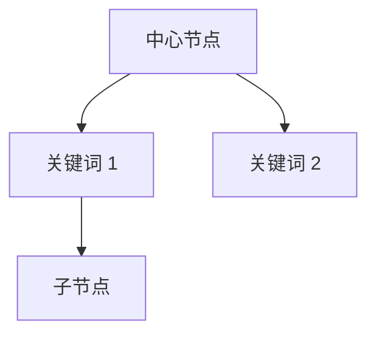

# Obsidian 技能 v2 💎

**增强版** - 基于实战经验优化，支持 macOS/Windows/Linux

---

## 核心理念

> **Obsidian Vault = 普通文件夹**  
> 所有笔记都是纯文本 Markdown，可用任何编辑器操作

---

## Vault 结构

```
Vault/
├── *.md                    # 笔记（纯文本 Markdown）
├── *.canvas                # 画布（JSON 格式）
├── Attachments/            # 附件（图片/PDF 等）
├── Templates/              # 模板文件夹
├── .obsidian/              # 配置（插件/工作区设置）
└── CoPaw/                  # 示例：AI 生成的内容
    ├── 知识图谱/
    └── 思考日记/
```

**注意**：
- ✅ 可直接编辑 `.md` 文件，Obsidian 会自动同步
- ❌ 不要修改 `.obsidian/` 配置（除非明确知道后果）
- ⚠️ 避免在隐藏文件夹（`.something/`）下创建笔记

---

## 找到活动 Vault

### 方法 1: 读取配置文件（最可靠）

**macOS**: `~/Library/Application Support/obsidian/obsidian.json`  
**Windows**: `%APPDATA%\obsidian\obsidian.json`  
**Linux**: `~/.config/obsidian/obsidian.json`

```python
import json
from pathlib import Path

# macOS 示例
config_path = Path.home() / "Library/Application Support/obsidian/obsidian.json"
config = json.load(open(config_path))

for vault_name, vault_info in config.get("vaults", {}).items():
    if vault_info.get("open", False):
        vault_path = Path(vault_info["path"])
        print(f"活动 Vault: {vault_path}")
```

### 方法 2: 使用 obsidian-cli

```bash
# 设置默认 Vault（一次性）
obsidian-cli set-default "vault-name"

# 查看默认 Vault
obsidian-cli print-default
obsidian-cli print-default --path-only
```

### 方法 3: 常见位置备用

```python
known_vaults = [
    Path.home() / "mlx-code-vault",
    Path.home() / "Documents/Obsidian Vault",
    Path.home() / "Obsidian Vault",
    Path.home() / "iCloud/obsidian-vaults"
]

for vault in known_vaults:
    if vault.exists():
        print(f"找到 Vault: {vault}")
```

---

## 操作方式对比

| 方式 | 优点 | 缺点 | 适用场景 |
|------|------|------|---------|
| **直接文件操作** | 最可靠、快速 | 不更新链接 | 批量创建/编辑 |
| **obsidian-cli** | 更新 wikilinks | 依赖 CLI 工具 | 移动/重命名 |
| **Obsidian URI** | 打开笔记/运行命令 | 需要 Obsidian 运行 | 交互操作 |

---

## 常用操作

### 📝 创建笔记

**方式 1: 直接写入（推荐）**
```python
vault_path = get_vault_path()  # 你的函数
note_path = vault_path / "CoPaw/知识图谱/索引.md"
note_path.parent.mkdir(parents=True, exist_ok=True)

content = """---
tags: [copaw, index]
created: 2026-04-08
---

# 知识图谱索引
"""

with open(note_path, "w", encoding="utf-8") as f:
    f.write(content)
```

**方式 2: obsidian-cli**
```bash
obsidian-cli create "CoPaw/知识图谱/索引" \
  --content "# 知识图谱" \
  --open
```

### 🔍 搜索笔记

```bash
# 搜索笔记名称
obsidian-cli search "keyword"

# 搜索内容（显示片段）
obsidian-cli search-content "keyword"

# Python 直接搜索
for md_file in vault_path.glob("**/*.md"):
    if "keyword" in md_file.read_text():
        print(f"找到：{md_file}")
```

### 🔄 移动/重命名（安全）

```bash
# 自动更新所有 wikilinks
obsidian-cli move "old/path/note" "new/path/note"
```

**Python 实现链接更新**（如果不用 CLI）：
```python
import re

def update_wikilinks(vault_path, old_name, new_name):
    """更新所有笔记中的 [[wikilinks]]"""
    for md_file in vault_path.glob("**/*.md"):
        content = md_file.read_text(encoding="utf-8")
        # 替换 [[old]] -> [[new]]
        content = re.sub(
            rf'\[\[{re.escape(old_name)}(\|[^\]]*)?\]\]',
            f'[[{new_name}\\1]]',
            content
        )
        md_file.write_text(content, encoding="utf-8")
```

### 🗑️ 删除笔记

```bash
obsidian-cli delete "path/to/note"
```

或直接删除文件（不更新链接）：
```python
note_path.unlink()
```

### 🖼️ 处理附件

```python
# 读取附件配置
attachments_folder = "Attachments"  # 默认

# 保存图片
import shutil
shutil.copy("local/image.png", vault_path / attachments_folder / "image.png")

# 在笔记中引用
content = f""
```

---

## 高级用法

### 1. Mermaid 图谱生成

```python
mermaid_content = """

"""

# 写入笔记，Obsidian 自动渲染
with open(vault_path / "知识图谱.md", "w") as f:
    f.write(mermaid_content)
```

### 2. 双向链接管理

```python
# 创建双向链接
content = """
# 笔记标题

相关笔记：
- [[笔记 1]]
- [[笔记 2|自定义显示文本]]

反向链接：
- 其他笔记通过 `[[本笔记]]` 引用
"""
```

### 3. Frontmatter 元数据

```python
from datetime import datetime

content = f"""---
tags: [copaw, thought]
created: {datetime.now().strftime('%Y-%m-%d %H:%M')}
updated: {datetime.now().strftime('%Y-%m-%d %H:%M')}
frequency: 5
aliases: [别名 1, 别名 2]
---

# 笔记内容
"""
```

### 4. Dataview 查询

```python
# 在笔记中插入 Dataview 查询
dataview_query = """
```dataview
TABLE created, frequency
FROM #copaw
SORT frequency DESC
LIMIT 10
```
"""
```

### 5. 模板系统

```python
template = """---
tags: [{tags}]
created: {created}
---

# {title}

## 内容

{content}

## 链接

- [[相关笔记]]
"""

note_content = template.format(
    tags="copaw, keyword",
    created=datetime.now().strftime('%Y-%m-%d'),
    title="笔记标题",
    content="笔记正文..."
)
```

---

## 实战案例

### 案例 1: CoPaw 知识图谱集成

```python
#!/usr/bin/env python3
"""CoPaw × Obsidian 集成 - 自动生成知识图谱"""

import json
from pathlib import Path
from datetime import datetime

def get_vault_path():
    """获取活动 Vault 路径"""
    config_path = Path.home() / "Library/Application Support/obsidian/obsidian.json"
    config = json.load(open(config_path))
    for name, info in config.get("vaults", {}).items():
        if info.get("open", False):
            return Path(info["path"])
    return None

def create_knowledge_graph():
    vault = get_vault_path()
    if not vault:
        return
    
    # 创建文件夹
    copaw_dir = vault / "CoPaw/知识图谱"
    copaw_dir.mkdir(parents=True, exist_ok=True)
    
    # 生成 Mermaid 图谱
    mermaid = "graph TD\n    CoPaw[🐙 CoPaw 知识库]"
    for keyword in ["AI", "知识管理", "自动化"]:
        mermaid += f"\n    CoPaw --> {keyword}"
    
    # 创建索引笔记
    content = f"""---
tags: [copaw, knowledge-graph]
created: {datetime.now().strftime('%Y-%m-%d')}
---

# CoPaw 知识图谱

```mermaid
{mermaid}
```

## 关键词

- [[AI]]
- [[知识管理]]
- [[自动化]]
"""
    
    (copaw_dir / "索引.md").write_text(content, encoding="utf-8")
    print("✅ 知识图谱已创建")

if __name__ == "__main__":
    create_knowledge_graph()
```

### 案例 2: 批量同步笔记

```python
def sync_notes_to_obsidian(source_dir, vault_path, category="copaw"):
    """批量同步笔记到 Obsidian"""
    target_dir = vault_path / category
    target_dir.mkdir(parents=True, exist_ok=True)
    
    for source_file in source_dir.glob("*.md"):
        # 读取内容
        content = source_file.read_text(encoding="utf-8")
        
        # 添加 Frontmatter
        frontmatter = f"""---
tags: [{category}, synced]
synced: {datetime.now().strftime('%Y-%m-%d %H:%M')}
source: {source_file.name}
---

"""
        # 写入目标文件
        target_file = target_dir / source_file.name
        target_file.write_text(frontmatter + content, encoding="utf-8")
    
    print(f"✅ 已同步 {len(list(source_dir.glob('*.md')))} 篇笔记")
```

---

## 故障排查

### 问题 1: 找不到 Vault

```python
# 检查配置文件是否存在
config_path = Path.home() / "Library/Application Support/obsidian/obsidian.json"
if not config_path.exists():
    print("❌ Obsidian 配置文件不存在")
    print("   请先打开 Obsidian 并创建一个 Vault")
```

### 问题 2: 笔记不显示

- ✅ 检查文件扩展名是否为 `.md`
- ✅ 检查是否在隐藏文件夹中
- ✅ 在 Obsidian 中刷新（Cmd/Ctrl + R）

### 问题 3: Wikilinks 不更新

```bash
# 使用 obsidian-cli 移动（自动更新链接）
obsidian-cli move "old" "new"

# 或手动更新
python -c "
import re
from pathlib import Path
for f in Path('vault').glob('**/*.md'):
    f.write_text(f.read_text().replace('[[old]]', '[[new]]'))
"
```

### 问题 4: 附件不显示

```python
# 检查附件路径
attachments = vault_path / "Attachments"
attachments.mkdir(exist_ok=True)

# 使用相对路径
content = ""
```

---

## 最佳实践

### ✅ 推荐

1. **直接文件操作** - 最可靠，Obsidian 自动同步
2. **使用 Frontmatter** - 便于插件和查询
3. **标准化标签** - `#category/subcategory` 层次结构
4. **相对路径** - 附件使用相对路径
5. **UTF-8 编码** - 始终指定 `encoding="utf-8"`

### ❌ 避免

1. **硬编码路径** - 读取配置文件获取 Vault 路径
2. **修改 .obsidian/** - 除非明确知道后果
3. **隐藏文件夹** - 避免在 `.something/` 下创建笔记
4. **大文件** - 附件超过 10MB 考虑外部存储
5. **特殊字符** - 文件名避免 `<>:"/\|?*`

---

## 工具推荐

### CLI 工具

```bash
# 安装 obsidian-cli
brew install yakitrak/yakitrak/obsidian-cli

# 验证安装
obsidian-cli --help
```

### Python 库

```python
# 推荐库
pip install pyyaml  # Frontmatter 处理
pip install python-frontmatter  # 更好的 Frontmatter 支持
```

### Obsidian 插件

- **Dataview** - 数据库式查询
- **Templater** - 高级模板
- **QuickAdd** - 快速创建笔记
- **Obsidian Git** - 版本控制

---

## 快速参考

```bash
# 设置默认 Vault
obsidian-cli set-default "vault-name"

# 创建笔记
obsidian-cli create "path/note" --content "内容" --open

# 搜索
obsidian-cli search "关键词"
obsidian-cli search-content "关键词"

# 移动（更新链接）
obsidian-cli move "old" "new"

# 删除
obsidian-cli delete "path/note"

# 打开笔记
obsidian-cli open "path/note"
```

```python
# Python 快速操作
from pathlib import Path

vault = Path("/path/to/vault")

# 创建
(vault / "note.md").write_text("# 标题", encoding="utf-8")

# 读取
content = (vault / "note.md").read_text(encoding="utf-8")

# 搜索
for f in vault.glob("**/*.md"):
    if "关键词" in f.read_text():
        print(f)
```

---

## 更新日志

### v2 (2026-04-08) - 增强版

- ✅ 新增直接文件操作指南（最可靠方式）
- ✅ 新增 Mermaid 图谱生成示例
- ✅ 新增 Frontmatter 最佳实践
- ✅ 新增故障排查章节
- ✅ 新增实战案例（CoPaw 集成）
- ✅ 优化跨平台支持（macOS/Windows/Linux）
- ✅ 优化结构和可读性

### v1 (原始版)

- 基础 Obsidian 操作指南
- obsidian-cli 快速入门

---

**提示**: Obsidian 的强大之处在于**纯文本 + 本地存储**，任何编辑器都能操作，任何脚本都能自动化！🚀
